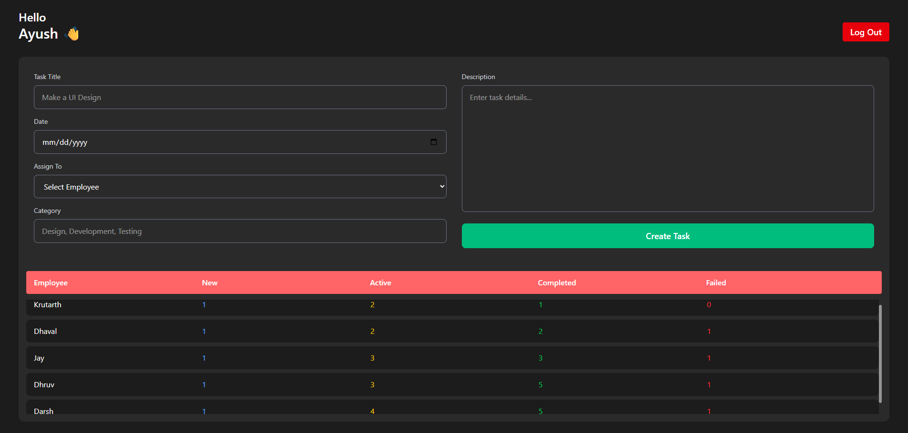
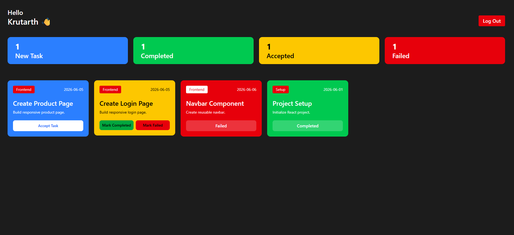

# 🚀 Employee Task Management System (React + LocalStorage)

A simple and interactive Employee Task Management System built using React.  
This project allows an Admin to assign tasks to employees and employees to manage their tasks by accepting, completing, or marking them as failed.  
All data is stored using LocalStorage, so the app works without any backend.

---

## 🌐 Live Demo

https://employee-management-ayushh025.vercel.app

---

## 🔐 Demo Credentials

### Admin

Email: admin@ex.com
Password: 123456

### Employee

Email: emp1@ex.com  
Password: 123456

Email: emp2@ex.com  
Password: 123456

Email: emp3@ex.com  
Password: 123456

Email: emp4@ex.com  
Password: 123456

Email: emp5@ex.com  
Password: 123456

---

## 📸 Screenshots

### Login Page


### Admin Dashboard



### Admin Dashboard



---

## ✨ Features

### 👨‍💼 Admin

- Admin login system
- Create and assign tasks to employees
- View employee task statistics

### 👨‍💻 Employee

- Employee login system
- View assigned tasks
- Accept tasks
- Mark tasks as Completed
- Mark tasks as Failed
- Real-time UI updates

---

## 🔄 Task Flow

New Task → Accepted (Active) → Completed / Failed

---

## 💾 Data Storage

- Uses LocalStorage (no backend required)
- Data persists after refresh
- Employees + Tasks stored in browser storage

---

## 🛠️ Tech Stack

- React JS
- Context API
- JavaScript (ES6+)
- Tailwind CSS
- LocalStorage

---

## ⚠️ Important Note on Data Storage

This project uses **LocalStorage** to store data instead of a backend database.

Because of this:

- Data is stored **locally in each browser/device**
- The same login on different devices will NOT share data
- Each browser has its own independent storage

Example:
If a task is created on one PC, it will not automatically appear on another PC, even with the same login credentials.

---

## ⚙️ Setup Instructions

```bash
git clone https://github.com/your-username/your-repo.git
cd your-repo
npm install
npm run dev
```